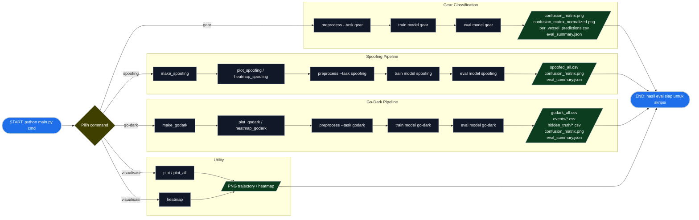

# Flowchart Project AIS/GFW Gear + Spoofing + Go-Dark

Versi ini sudah menghapus command `predict`. Tahap akhir untuk laporan skripsi adalah `eval`, karena confusion matrix, metrics, dan tabel prediksi evaluasi sudah dibuat di sana.

